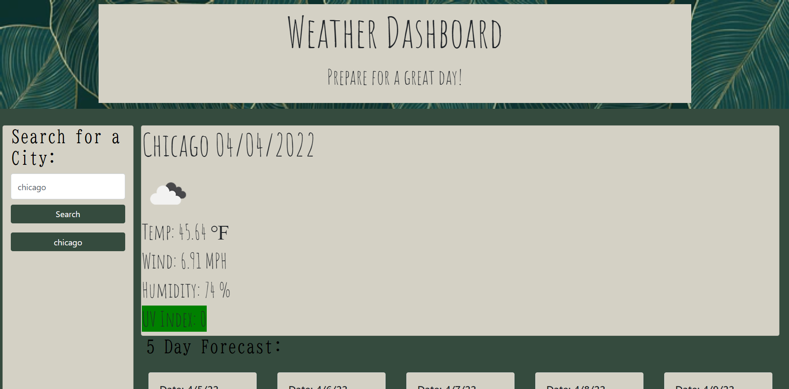
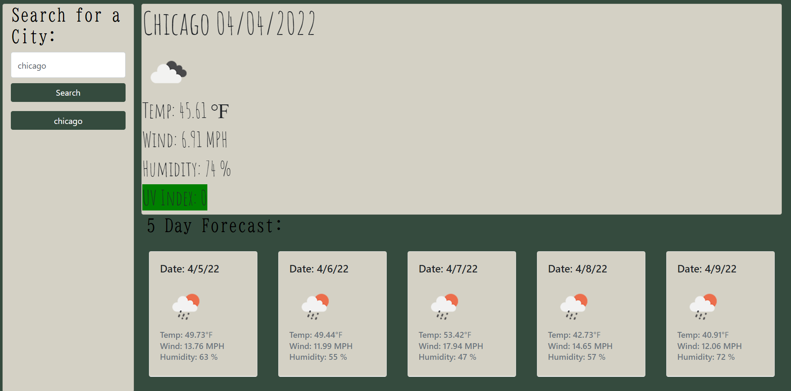

#Weather Dashboard

For this Application the user will be able to view current weather information by city name. 

Technology Used -

    ‣ Bootstrap CSS

    ‣ JQuery

    ‣ Google Fonts

IF the user types in a city name THEN they are able to view current weather information for that city as well as a 5 day forecast.
IF the user types in a city name THEN a button is made with the text being equal to the city the user entered in.
IF the user does not type in a city name THEN an alert pops up telling the user the city was not found.
The current weather information will include the name of the city, the current date, an icon depicting current weather conditions, the current temperature, the current wind, the current humidity, and the current UV Index. 
The UV Index will display a backround color indicating if the UV Index level is low, moderate, high, very high, or extreme.

A green background will indicate current UV Index levels are low.
A yellow background will indicate current UV Index levels are moderate.
An orange background will indicate the current UV Index levels are high.
A red background will indicate the current UV Index levels are very high
A purple background will indicate the current UV Index levels are extreme.

In the 5 day forecast the user will be able to see the expected temperature, wind, and humidity for the next 5 days, with the date being displayed at the top of each card to indicate which date the expected weather conditions are for. An Icon will also be displayed to indicate expected weather conditions. 

Click [here](https://nicoled1999.github.io/weather-dashboard/) to view my website

